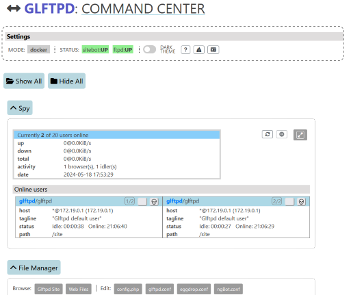
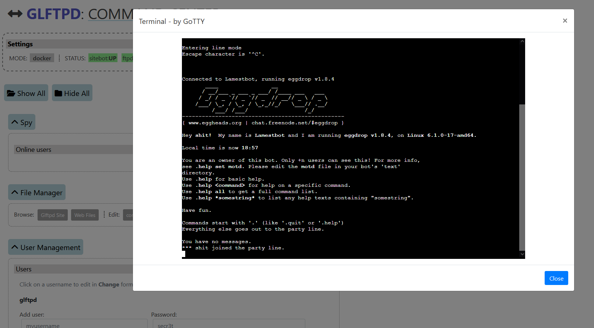

# glftpd-webui (v3) WIP

## /gl wɛb ʊi/

Web GUI for [glftpd](https://glftpd.io) (linux)

Shows online users, status and stops/starts glftpd. Can also be used to view logs, edit config files and browse site. All user management can be done using forms. Includes a browser terminal that displays gl_spy, useredit and bot partyline (using websockets). It should display fine on mobile devices too.

_Main page UI, click to enlarge_

## Usage

Start: `docker run ghcr.io/silv3rr/glftpd-webui`

Open url: https://your.ip:4444 and login: `shit/EatSh1t`  (basic web auth).

## Setup

Pick one of these 3 options

**1**) The easiest and preferred way to use glftpd-webui is to run both glftpd and ui in 2 docker containers. *Ready-to-go complete gl install: https://github.com/silv3rr/docker-glftpd*

**2**) If you do not want to use glftpd in docker, use 'local' mode.

**3**) Install ui without using docker at all. Needs nginx with php-fpm8 or newer, copy ui files to document root (e.g. /var/www/html):
- assets, lib, templates and src dirs
- download/replace pyspy and pywho for your distro
- copy/compile other bins (gotty, hashgen, passchk)
- copy etc/sudoers.d/glftpd-web

See Dockerfile for details.

### Requirements

- User management: needs access to /glftpd dir, either in glftpd container or on same host
- Stop/start glftpd: needs access to docker socket or systemd/service + sudo in local mode
- Terminal commands: run in glftpd container or on same host in local mode

### Configuration

Options 'docker' or 'local' mode, auth and custom html title can be changed in `config.php`.

In docker mode the gl container must be named 'glftpd' (if it's not, edit `config.php` to change)

In local mode, the quickest way to access '/glftpd' dir is to bind mount it in the ui container. By default localhost is used to connect to gl/bot/spy/gotty.

Make sure your client's source ip is whitelisted. Default is `allow` all private ip ranges. To change edit etc/nginx/http.d/webui.conf. For docker, rebuild image.

#### Auth

- basic: http authentication using nginx (default)
- glftpd: uses ftpd username/password, verifies with `passchk` bin
- both: both glftpd and basic using php
- none: disable auth

To change user/pass used for basic auth, see `'http_auth'` option

## Image

- base: latest alpine
- size: ~50mb
- separate image from 'glftpd'
- webserver: nginx, php8 fpm
- logs: nginx logs to stderr/stdout

View access logs with `docker logs glftpd-web`.

## Troubleshooting

- x doesnt work
    - start with checking nginx error log for (php) errors, in docker mode: `docker logs glftpd-webui`
    - change error_log in nginx config from to `error_log  /var/log/nginx/error.log debug;`

- docker (api) doesnt work
    - set `debug` in config to 3, test and check /tmp/curl_err.log

- user mgmt errors
    - test running `gltool.sh` manually,  e.g. `bin/gltool.sh -c RAWUSERFILE -u test`

- status incorrectly shows glftpd/bot down 
    - check ports in `services` option in config.php

-  why is this using docker / not properly written OOP code / not react / js framework x
    - coz of ur mom

## Stack

Cutting-edge tech used:

- PHP, some JQuery and Bootstrap4
- User management: [gltool.sh](https://github.com/silv3rr/scripts/blob/master/gltool.sh) wrapper (Bash)
- Filemanager: [tinyfilemanager](https://tinyfilemanager.github.io/)
- Web Terminal: [GoTTY](https://github.com/sorenisanerd/gotty)
- Spy: [pyspy](https://github.com/silv3rr/pyspy) (flask)
- Pywho: uses [ansi-escapes-to-html](https://github.com/neilime/ansi-escapes-to-html)

# Screenshots 

_Notification about added gadmin_

_Terminal modal showing bot_

> View **[more images](docs/images)**
